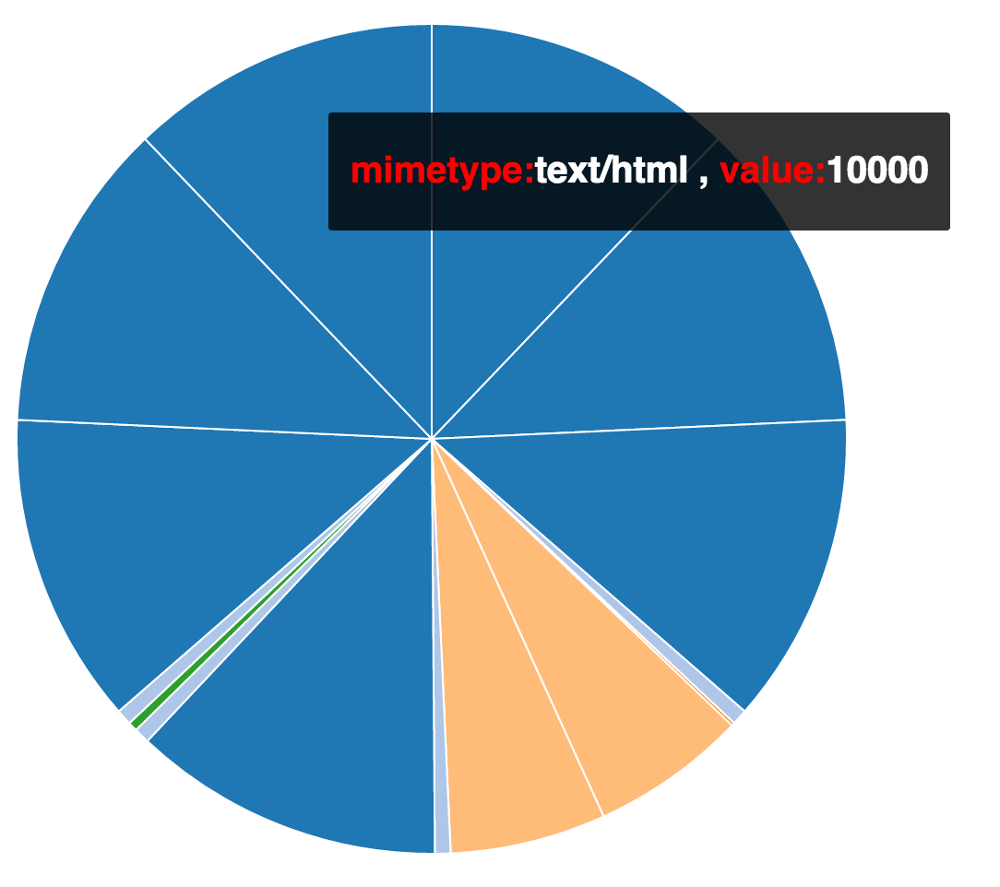
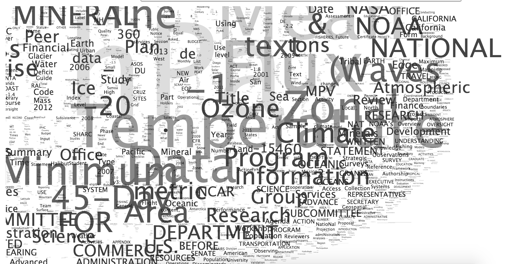
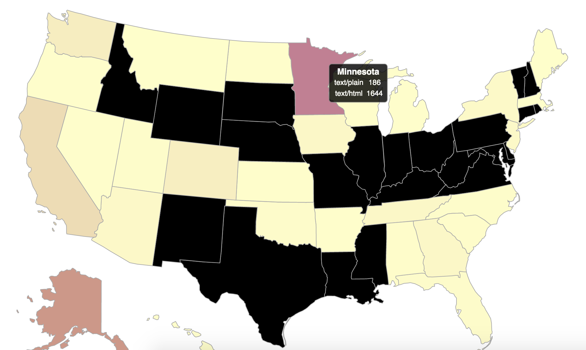
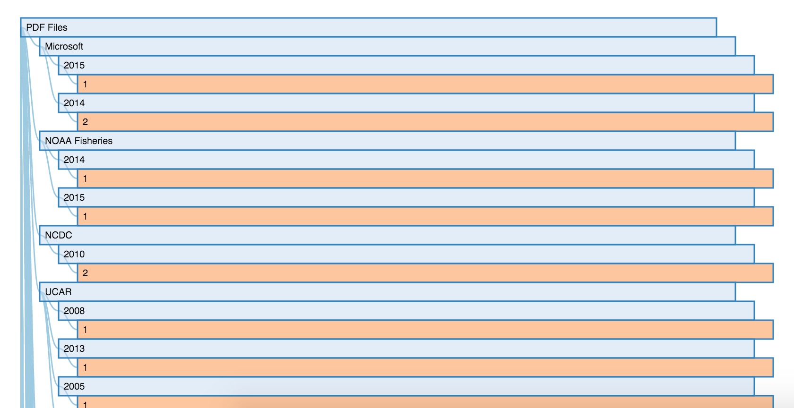
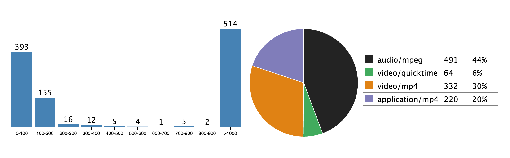
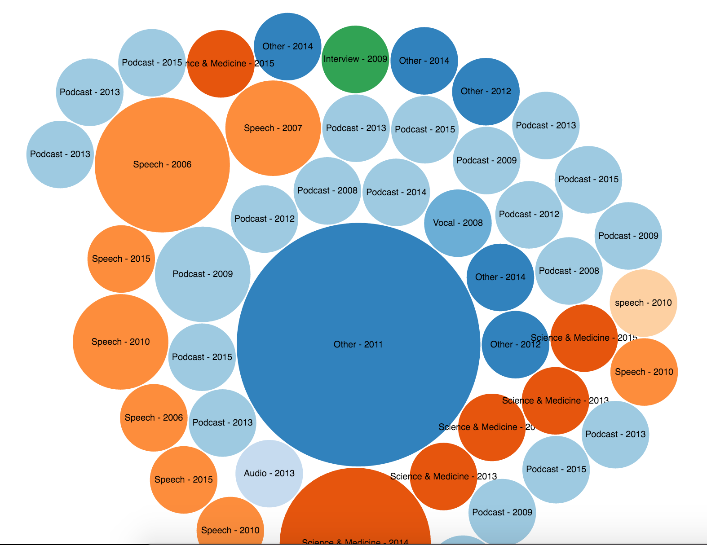
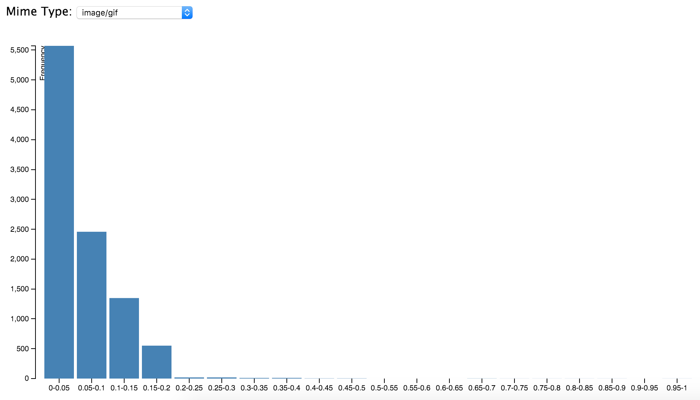

# Polar Data Visualizations After Scientific Content Enrichment

This is the website of my findings of the Scientific Content Enrichment of the Text Retrieval Conference (TREC) Polar Dynamic Domain Dataset. This was for the assignment of [CS 599 Content Detection and Analysis for Big Data](http://sunset.usc.edu/classes/cs599_2016/), taught by [Dr. Chris Mattmann](http://sunset.usc.edu/~mattmann/). More details about the assignment can be found [here](http://sunset.usc.edu/classes/cs599_2016/CS599_HW_CE_MET_NER_POLAR.pdf).

## About
We worked with the same dataset as the previous assignment (More details about the same are given [here](https://github.com/antrromet/599-Mime-Diversity-Analysis)). In this assignment we did Content Extraction of Metadata, Information Clustering and Similarity and Named Entity Recognition to scientifically enrich the Polar dataset.

1. We used [Tika](https://tika.apache.org/) to parse through the entire dataset and fetch the relevant keys from all the mime types. Now Tika itself gives you a lot of useful information about the files. It ranges from `title`, `description` in the `html` files to `channels`, `audioSampleRate` in `mp3` files. The exact keys that were fetched from Tika are given below.
   * **`application/mp4`**: `xmpDM:duration`, `xmpDM:audioSampleRate`, `tiff:ImageLength`, `tiff:ImageWidth`
   * `application/msword`: `comment`, `cp:subject`, `Last-Author`, `Application-Name`, `Author`, `Comments`, `Template`, `Company`, `Page-Count`, `Revision-Number`, `title`, `Word-Count`, `Character Count`
   * **`application/pdf`**: `xmpMM:DocumentID`, `Author`, `tiff:ImageWidth`, `pdf:PDFVersion`, `xmpTPg:NPages`
   * **`application/rss+xml`**: `description`, `title`
   * **`application/xhtml+xml`**: `description`, `title`, `author`, `Content-Encoding`
   * **`application/xml`**: `Content-Encoding`
   * **`audio/mpeg`**: `channels`, `xmpDM:duration`, `xmpDM:audioSampleRate`, `xmpDM:audioCompressor`, `version`, `xmpDM:audioChannelType`, `samplerate`, `title`, `Author`, `xmpDM:releaseDate`, `xmpDM:album`, `xmpDM:trackNumber`, `xmpDM:genre`
   * **`image/gif`**: `Chroma ColorSpaceType`, `Chroma NumChannels`, `Dimension ImageOrientation`, `height`, `width`, `Compression CompressionTypeName`
   * **`image/jpeg`**: `File Size`, `X Resolution`, `Image Height`, `Number of Components`, `Image Width`, `File Name`, `Y Resolution`, `Data Precision`, `Resolution Units`, `tiff:BitsPerSample`
   * **`image/png`**: `height`, `width`, `Chroma ColorSpaceType`, `Chroma NumChannels`, `Dimension PixelAspectRatio`
   * **`text/html`**: `dc:title`, `DC.Publisher`, `DC.Publisher.Address`, `description`, `DC.Subject`, `orgcode`, `description`
   * **`text/plain`**: `Content-Encoding`
   * **`video/quicktime`**: `xmpDM:duration`, `xmpDM:audioSampleRate`, `tiff:ImageLength`, `tiff:ImageWidth` 
2. We wrote a Tag Ratio Parser to identify the relevant information from the files. After that, we used the [OpenNLP](http://wiki.apache.org/tika/TikaAndNER) parser to extract NER from the files. The following entity types were extracted: `PERSON`, `LOCATION`, `ORAGANIZATION`, `DATE`, `TIME`, `PERCENT` and `MONEY`.
3. We used [lstu](https://github.com/ldidry/lstu), which is a lightweight url shortner library, to create unique short urls for each file.
4. We used [Grobid Journal Parser](http://wiki.apache.org/tika/GrobidJournalParser/) in Tika to extract the TEI annotations from the scientific publications in our dataset. We extracted the following TEI headers from teh Grobid parsers output: `Company`, `created`, `pdf:PDFVersion`, `xmpTPg:NPages`, `keywords`, `authors`, `title`. We also used the Google Scholar API to fetch relevant articles/publications.
5. We performed GeoTopic parsing on the dateset to identify the lat long and the names of locations in the files.
6. We also created a Metadata quality score that took into account the so-called “Good Metadata” practices. This we used later on to fetch the most important and relevant information from Solr.
7. We then finally ingested all the above information that we extracted from various parsers into [Apache Solr](http://lucene.apache.org/solr/). We modified Solr's configuration so that it is able to index all the fields that we found above.
8. Finally, after ingesting our entire data into Solr, we ran queries on it and then made visualizations to study useful information about our dataset.
9. We also used the [EXIFTool](http://wiki.apache.org/tika/EXIFToolParser) to fetch relevant information from the video files. The information we fetched was `Avg Bitrate`, `Time Scale`, `File Size`, `Media Duration`, `Video Frame Rate`, `File Type Extension`, `Compressor ID`, `Movie Data Size`, `Megapixels`, `Image Size`, `Image Width`, `Bit Depth`, `X Resolution`, `Image Height`, `Y Resolution`, `Movie Data Offset`.

## Learnings
We used the following visualizations:

1. [Pie Chart](http://antrromet.github.io/Polar-Data-Visualizations/#pie_chart): This was the simplest D3 visualization that simply told about the different mime types that were fetched from the Solr query.
2. [Word Cloud](http://antrromet.github.io/Polar-Data-Visualizations/#word_cloud): This visualization showed the important words in the documents in the form of a Word Cloud. Before forming the Word Cloud, I removed the common stop words so that the D3 is not cluttered and we can gather useful information out of it. We noticed that certain keywords like `Ozone`, `Heat`, `National`, `NASA`, `Climate` and `Minerals` are very common in our dataset. This is not surprising as our data is from the TREC Polar dataset.
3. [US State Map](http://antrromet.github.io/Polar-Data-Visualizations/#us_state_map): This visualization showed the spread of various files and their mime types within each US State. The black states indicates that there are no files in that state, whereas the maroon area indicates that there are a lot of files. Minnesota has the maximum number of docs associated with it, whereas states like Texas, Ohio, Indiana, and some of the others had no docs at all.
4. [Collapsible Indented Tree](http://antrromet.github.io/Polar-Data-Visualizations/#collapsible_indented_tree): We used this visualization to indicate the publications found in our dataset. We clusered all the publications based upon the company under which they were published, like `NASA HQ`, `University of Washington`, and then within each company it was further divided based upon the years they were published in. All in all, you can see the various publication Companies along and the number of articles published in each Company in various years.
5. [Dashboard](http://antrromet.github.io/Polar-Data-Visualizations/#dashboard): This visualization indicated the duration spread of files between different mime types. For instance, we saw that most of the `audio mpeg` files had a duration greater than 1000s, whereas most of the `video quicktime` files were less than 100s in duration.
6. [Bubble Chart](http://antrromet.github.io/Polar-Data-Visualizations/#bubble_chart): This visualization was specific to the `audio mpeg` files. We identified the various genres under which each audio fell and also under which year were they published. We used bubble chart to represent the same. Same color bubbles indicated the same genre, and the different sizes of the bubbles were based upon the number of audio released in that year. We noticed that there were a lot of audio published under the `Science & Medicine` genre in the year 2014, and also in `Books & Spoken` in the year 2002.
7. [Bar Chart](http://antrromet.github.io/Polar-Data-Visualizations/#bar_chart): The last visualization we used was the Bar Chat. Using this you can see the various file size distribution ranges, based upon the mime type. For instance, we noticed that most of the `msword` files were in the mid ranges of around 50-60kb, whereas most of the `gif` files were very short in the range of 10-40kb. We calculated the graph by normalizing the file sizes amongst all the files and then diving them in 20 equal range from 0-1.

## Screenshots

1. Pie Chart
   
2. Word Cloud
   
3. US State Map
   
4. Collapsible Indented Tree
   
5. Dashboard
   
6. Bubble Chart
   
7. Bar Chart
   
